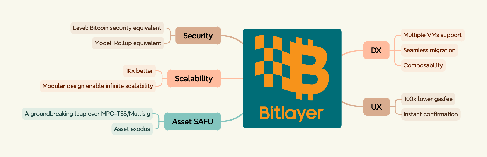

# Basic Concepts

To user/developer, the basic concept of Bitlayer as below:

Bitlayer is a layer 2 for Bitcoin, and now its **100% EVM-compatible**.

User can use the wallets such as **Metamask, imtoken or other Ethereum wallet** to interact with it.

Developer can easily migrate the smart contract writing in **Solidity, Vyper or other languages that can beccompiled to EVM-Bytecode** to Bitlayer.

# Architecture

Bitlayer follows the typical Optimistic-Rollup equivalent model.

# Benefits

# Bridges

There will be many bridges connected to Bitlayer.

If the **source chain** is Bitcoin, you should use UniSats, Xverse or other Bitcoin wallet as source wallet.